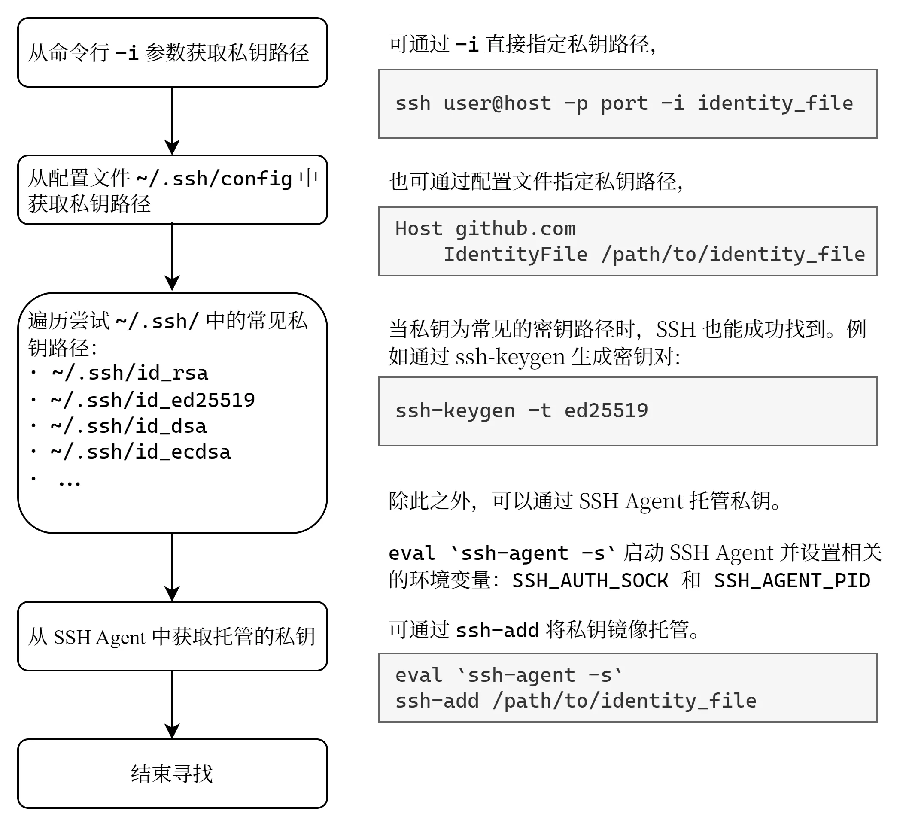

在使用 SSH 时，如果想要采用密钥认证的方式，可以将密钥的公钥信息，写入到服务器上用户家目录的 `~/.ssh/authorized_keys` 文件，之后便可通过密钥登录。

如果不指定密钥，也许 SSH 也可以成功找到合适的密钥来登录 😎

SSH 寻找合适密钥的流程大致如下：



## SSH Agent

SSH Agent 是一个 SSH 私钥托管程序，其将私钥解密（如果设有 passphrase）并存储在内存中。

在登录时，SSH 客户端首先向服务端发送公钥，服务端会回复一段随机生成的消息，请求客户端将其用私钥签名。SSH 客户端请求 SSH Agent 来签名，并将结果返回给服务端。服务端通过公钥解密并对比消息，以确认客户端的身份合法性。在该过程中，SSH Agent 仅负责将私钥用于签名。

在登录认证之后，SSH 服务端会生成一套新的临时对称密钥来加密通信，并在通信过程中不断地更新密钥。

SSH Agent 一般可能会自动启动，若没有，可通过 `ssh-agent -s` 启动 SSH Agent 并打印相关的环境变量配置脚本，再通过 `eval`，可以将这些环境变量激活。合在一起，即: 

```bash
eval `ssh-agent -s`
```

## Agent Forwarding

想象这样一个场景：在 SSH 登录服务器 A 后，想在服务器 A 上登录内网服务器 B，虽然可以将密钥对拷贝到服务器 A 上，但是这样过于麻烦和危险。这种场景就可以利用 Agent Forwarding. 

在 SSH 加上 `-A` 参数，或在配置文件加上 `ForwardAgent yes` 配置，则可以开启 Agent Forwarding. 此时，在 SSH 登录服务器 A 后，SSH 会在服务器 A 上自动创建一个 Unix Socket，并设置环境变量 `SSH_AUTH_SOCK` 指向该 Socket，并将发往该 Socket 的流量回传到客户端进行认证。

不过，这种方法也有安全隐患。当服务器 A 上有其他用户有权限访问该 Socket 时，便可以利用你的登录信息进行任何认证操作。一个更安全的方式是通过 `ProxyJump` 选项。

## ProxyJump

在 SSH 加上 `-J serverA` 参数，或在配置文件中添加 `ProxyJump` 选项，就可以更安全地登录服务器 B.

```bash
ssh -J serverA serverB
```

```
Host serverB
    ProxyJump serverA
```

此时，在 SSH 登录服务器 A 后，SSH 会自动在服务器 A 建立和服务器 B 的连接，并将该流量代理到客户端，然后，再次进行密钥握手认证登录服务器 B.

SSH 7.2 之后均支持这种方式。在此之前，类似的原理，也可以通过 `ProxyCommand` 实现.

```bash
ssh -o ProxyCommand="ssh serverA nc %h %p" serverB
```

```
Host serverB
  ProxyCommand ssh serverA nc %h %p
```
